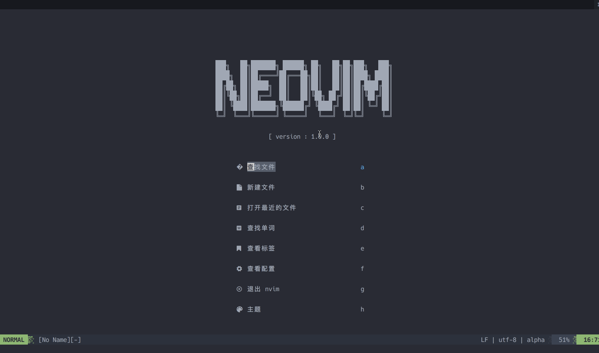

### neovim打造自己的IDE
完成之后的配置效果如下：




如果你想一键安装可以：
第一步
创建shell文件夹 随便哪个目录
```

$ mkdir shell
```
第二步，下载shel 脚本
```
$ wget https://github.com/zlongCoding/shell/blob/main/nvim.sh
/**
|    bashPath='修改成自己的主路径' 
|  
|   nvimPath="${bashPath}/Desktop/nvim"  //nvim下载地址
|   nvimConfig="${bashPath}/.config/nvim"   //nvim 配置地址
|   zshrcPath="${bashPath}/.zshrc"       //zshrc地址
|   nvimGitPath='https://github.com/neovim/neovim' 
**/
```
执行shell
```
$ chmod u+x ./nvim.sh
$ ./nvim.sh
```

第四步：
```
//vim 随便打开一个项目
$  vim
$ :PackerInstall //下载依赖
```
也可以自己安装。


卸载原来下载的依赖
```
rm -rf ~/.config/nvim
rm -rf ~/.local/share/nvim
rm -rf ~/.cache/nvim
```


### 快捷键
| 快捷键   |  功能  |
|--------------- | --------------- |
|  leader+1  |  打开/关闭侧边栏  |
| leader+2   |   光标定位到侧边栏 |
| leader+3   |   打开代码集合 |
| leader+]   |  格式化代码 |

